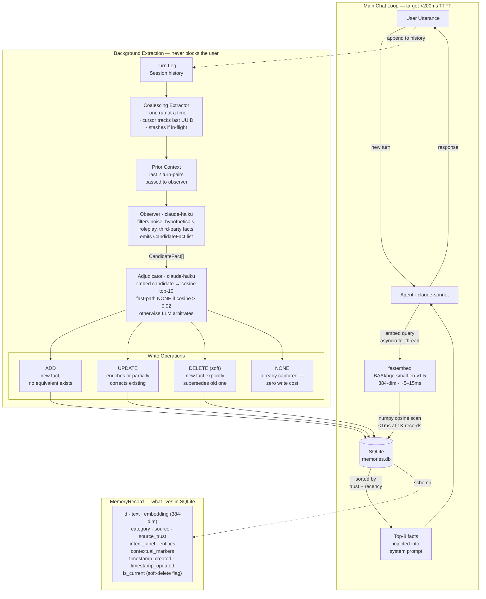

# Memory Architecture — Async Observer + Semantic KV

Two paths, completely decoupled. The read path is synchronous and fast — embed, scan, inject, done. The write path is async and never touches the hot loop.

---

## Diagram



---

## Fast Path

`memory.retrieve(query)` is synchronous by design so it can be fired as an `asyncio.Task` before the API call, hiding its latency behind model prefill:

```python
memory_prefetch = asyncio.create_task(asyncio.to_thread(memory.retrieve, user_input))
messages = build_messages(session, user_input)
memories = await memory_prefetch   # already done by the time we get here
```

Embed takes ~5–15ms with the local ONNX model. The cosine scan over 1K rows is a single numpy matmul — under 1ms. Total retrieval budget is ~20ms, fully hidden. Results are sorted by `(source_trust DESC, timestamp_updated DESC)` so the most credible and most recent facts surface first.

---

## Write Path

### Coalescing Extractor

Only one extraction runs at a time. If a new turn arrives while one is in-flight, the session is stashed and a single trailing run picks it up after the current one finishes — no concurrent pile-up, no dropped turns. A UUID cursor (`_last_processed_uuid`) tracks where extraction left off so each run only processes new turns.

```
schedule_extraction(session)   # fire-and-forget, never blocks
drain_pending_extraction()     # await before process exit
```

### Observer

Receives one `(user_turn, assistant_turn)` pair at a time, plus the last two prior pairs as context. The prior context is the key to filtering roleplay — "As Captain Torres, my base is DFW" looks like a real fact in isolation, but with the preceding "Let's do a roleplay" visible, the observer returns `[]`.

The NEVER list covers: greetings/filler, temporary task state, credentials/PII, facts about third parties (colleagues, family), hypothetical/conditional statements, roleplay personas, and assistant statements.

### Adjudicator

Before any LLM call, a fast-path check fires: if the top existing record has `cosine > 0.92` and `source_trust >= candidate.source_trust`, the candidate is already captured — return NONE without touching the LLM. This handles the common case of repeated or near-identical facts at zero cost.

For everything else, the adjudicator embeds the candidate, fetches the top-10 most similar existing records, and asks claude-haiku for one operation:

| Operation | When |
|---|---|
| `ADD` | No equivalent exists |
| `UPDATE` | Candidate enriches or partially corrects a record |
| `DELETE` | Candidate explicitly supersedes a record ("moved from X to Y") |
| `NONE` | Already captured accurately |

`DELETE` is always soft — `is_current = 0` in SQLite. The old record stays in the database for audit; it just disappears from search. If the adjudicator makes a wrong call, nothing is irreversibly lost.

---

## Source Trust

Every record carries a trust tier: `user_statement=3 > agent_inference=2 > document_extract=1`. When a candidate arrives with lower trust than the matching existing record, the fast-path NONE fires without LLM involvement — a user's explicit statement is never silently overwritten by an agent inference.

---

## Known Limitations

**Implicit staleness.** If a fact drifts without an explicit contradiction ("I used to prefer X, now I lean toward Y" without ever saying "I switched"), the old record persists. The adjudicator only issues DELETE on explicit supersession language. Documented in `test_implicit_staleness_not_detected`.

**O(N) scan at retrieval.** `store.search()` loads all active rows on every call. Fine at ≤5K records. Would need an ANN index (FAISS/hnswlib) beyond that.
